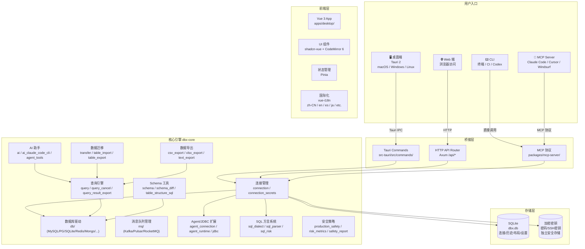
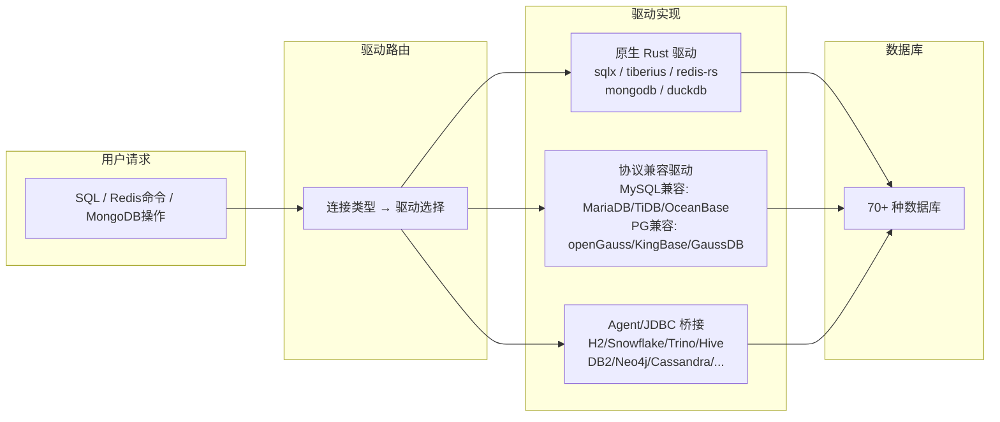
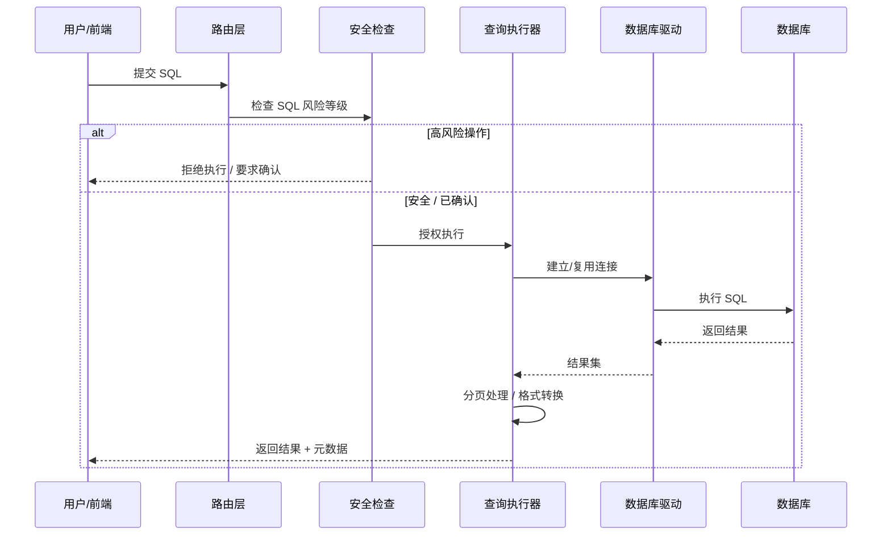
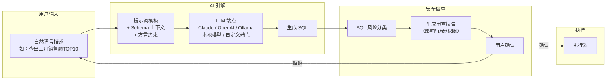
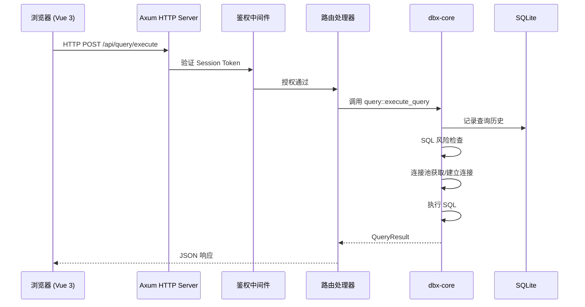
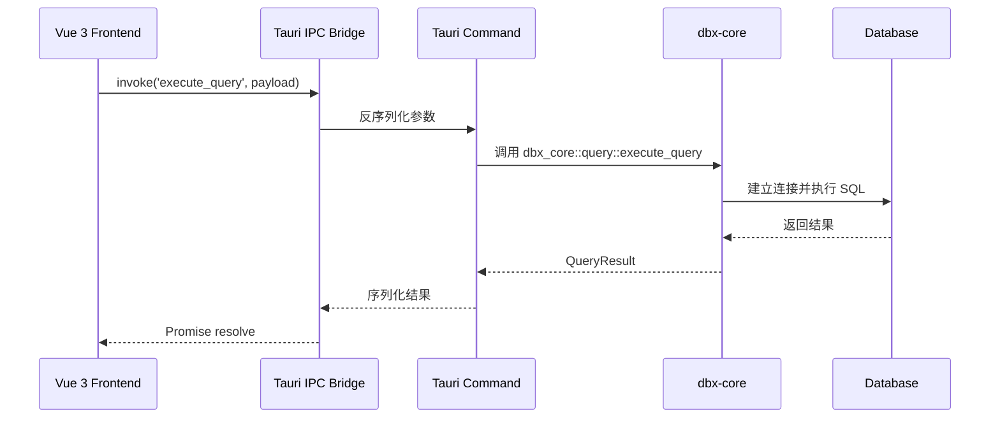

# DBX 架构文档

## 概述

DBX 是一款基于 Rust 构建的轻量级数据库管理工具，仅约 20 MB，无需 Java、Python 或 Chromium 等运行时依赖。单二进制文件支持桌面端（macOS/Windows/Linux）、Docker 自托管（Web 版）和命令行（CLI）三种运行模式，同时提供 MCP Server 与 AI 编程助手深度集成。

## 技术栈

| 层级       | 技术                                                                   |
| ---------- | ---------------------------------------------------------------------- |
| 框架       | [Tauri 2](https://tauri.app/)（桌面端）                                |
| 前端       | [Vue 3](https://vuejs.org/) + TypeScript + [Vite](https://vitejs.dev/) |
| UI         | [shadcn-vue](https://www.shadcn-vue.com/) + [Tailwind CSS 4](https://tailwindcss.com/) |
| 编辑器     | [CodeMirror 6](https://codemirror.net/)                                |
| 图表       | [ECharts 6](https://echarts.apache.org/)                               |
| Web 服务端 | [Axum](https://github.com/tokio-rs/axum)（Tokio 异步运行时）           |
| 数据存储   | SQLite（`dbx.db`，存储连接配置、查询历史、布局偏好等）                 |
| 数据库驱动 | sqlx、tiberius、redis-rs、mongodb、tokio-postgres、mysql_async 等 Rust 原生驱动 |
| 构建工具   | pnpm workspace + Make + Gradle（Agent/JDBC 扩展）                      |

## 系统架构



## 仓库结构

```
dbx/
├── crates/                    # Rust 核心包
│   ├── dbx-core/              # 核心业务逻辑：连接、查询、Schema、AI、数据迁移等
│   ├── dbx-web/               # Web 服务端：Axum HTTP API、鉴权、SSE
│   ├── dbx-mcp/               # MCP Server：后端抽象 + 协议实现
│   └── dbx-cli/               # CLI 命令行工具
├── src-tauri/                 # Tauri 桌面端
│   ├── src/
│   │   ├── commands/          # Tauri IPC 命令（与 dbx-core 方法一一对应）
│   │   ├── lib.rs             # Tauri 应用入口与插件注册
│   │   └── main.rs            # 桌面端启动入口
│   └── Cargo.toml
├── apps/desktop/              # Vue 3 前端
│   └── src/
│       ├── App.vue            # 根组件
│       ├── components/        # UI 组件（40+ 组件目录）
│       ├── composables/       # 组合式函数
│       ├── stores/            # Pinia 状态管理
│       ├── i18n/              # 国际化（7 种语言）
│       ├── lib/               # 工具函数与类型
│       └── types/             # TypeScript 类型定义
├── packages/                  # Node.js 发布包
│   ├── cli/                   # @dbx-app/cli npm 包
│   ├── mcp-server/            # @dbx-app/mcp-server npm 包
│   ├── mongo-shell/           # MongoDB Shell 解析器
│   └── cli-*/ + mcp-*/       # 各平台原生二进制包
├── plugins/                   # 插件系统
│   ├── dialects/              # SQL 方言配置文件（YAML）
│   ├── jdbc/                  # JDBC 驱动管理器
│   └── mappings/              # 类型映射
├── agents/                    # Agent/JDBC 驱动工程（Gradle）
│   ├── common/                # 通用代码
│   ├── drivers/               # 各数据库 JDBC 驱动实现
│   └── scripts/               # 构建与发布脚本
├── docs/                      # 文档站（Next.js）
│   └── content/docs/          # MDX 文档内容
├── deploy/                    # 部署配置
│   ├── database/              # 本地测试数据库 Docker Compose 配方
│   ├── dockerhub/             # Docker 镜像构建
│   └── homebrew/              # Homebrew Formula
├── examples/                  # 示例代码（CLI/MCP/Docker/Web API）
├── tests/                     # 测试工具与数据
├── skills/                    # Agent 技能配置
├── scripts/                   # 构建与发布脚本
├── Makefile                   # 统一开发入口
├── Cargo.toml                 # Rust workspace
├── package.json               # Node.js workspace（pnpm）
└── pnpm-workspace.yaml        # pnpm workspace 配置
```

## 核心模块详解

### 1. 连接管理 (`connection`)

```
crates/dbx-core/src/connection.rs
crates/dbx-core/src/connection_secrets.rs
crates/dbx-core/src/ssh_config.rs
crates/dbx-core/src/db/ssh_tunnel.rs
crates/dbx-core/src/db/ssh_host_key.rs
crates/dbx-core/src/db/proxy_tunnel.rs
crates/dbx-core/src/db/transport_layer_tunnel.rs
```

- **连接池管理**：统一管理所有数据库连接的生命周期
- **密钥安全存储**：密码、SSH 密钥等敏感信息加密独立存储，与普通 JSON 分离
- **SSH 隧道**：密钥和密码认证、主机密钥验证
- **代理隧道**：SOCKS5/HTTP 代理、Web 网关转发
- **断线重连**：自动检测连接健康状态并重连

### 2. 数据库驱动层 (`db/`)

```
crates/dbx-core/src/db/
├── mod.rs                    # 驱动注册与路由
├── mysql.rs / postgres.rs / sqlite.rs   # 原生 SQL 驱动
├── sqlserver.rs / clickhouse_driver.rs / oracle.rs
├── redis_driver.rs           # Redis 客户端
├── mongo_driver.rs           # MongoDB 客户端
├── elasticsearch_driver.rs / easysearch_driver.rs
├── duckdb_sql.rs / duckdb_worker_process.rs
├── influxdb_driver.rs / rqlite_driver.rs / turso_driver.rs
├── vector_driver.rs          # 向量数据库（Qdrant/Milvus/Weaviate/ChromaDB）
├── hbase_driver.rs           # HBase REST 驱动
├── agent_driver.rs           # Agent/JDBC 桥接驱动
├── http_tunnel.rs            # HTTP 隧道（Cloudflare D1/Turso）
├── file_validator.rs         # 文件型数据库路径校验
└── wkb.rs                    # PostGIS WKB 几何数据解析
```

**驱动架构三层模型**：



### 3. 查询引擎 (`query`)

```
crates/dbx-core/src/query.rs                 # 查询执行核心
crates/dbx-core/src/query_cancel.rs          # 查询取消与超时
crates/dbx-core/src/query_execution_sql.rs   # SQL 执行计划构建
crates/dbx-core/src/query_result_sql.rs      # 结果集处理
crates/dbx-core/src/query_result_export.rs   # 结果导出管道
crates/dbx-core/src/sql.rs                   # SQL 分析（引用/语句识别）
crates/dbx-core/src/sql_analysis.rs          # SQL 语义分析
crates/dbx-core/src/sql_diagnostics.rs       # SQL 诊断提示
crates/dbx-core/src/sql_editability.rs       # 结果集可编辑性判定
```

**查询执行流程**：



**SQL 风险等级**：
- `ReadOnly`：只读查询，直接执行
- `Write`：数据写入（INSERT/UPDATE/DELETE），需要 `--allow-writes`
- `Ddl`：结构变更（CREATE/ALTER/DROP），需要 `--allow-dangerous-sql`
- `Transaction`：事务控制，需要 `--allow-writes`
- 生产数据库写入自动阻止（可通过连接标签覆盖）

### 4. SQL 方言系统 (`sql_dialect`)

```
crates/dbx-core/src/sql_dialect/
├── descriptor.rs              # 方言描述（SQL 特性标注）
├── descriptor_snapshots.rs    # 描述快照（测试对比）
├── dialect_loader.rs          # 方言注册与 YAML 加载
├── dialect_types.rs           # 方言类型定义
├── dialect_yaml.rs            # YAML 格式解析
├── identifiers.rs             # 标识符引用规则
├── inference.rs               # 从连接类型推断方言
├── capabilities.rs            # 功能能力矩阵
├── ddl_profile.rs             # DDL 行为配置（事务性DDL、类型重写等）
├── type_rewrite.rs            # 跨数据库类型重写
├── types.rs                   # 数据类型映射
├── table_select.rs            # 表选择查询生成
├── hot_reload.rs              # 方言配置热重载
└── tests.rs                   # 方言兼容性测试
```

**方言系统设计**：
- 每个数据库类型对应一个方言描述文件（YAML 格式）
- 方言描述定义：标识符引用方式、SQL 语法特性、数据类型映射、DDL 能力等
- 支持插件化扩展：`plugins/dialects/` 目录下可放置自定义方言配置
- 支持热重载：开发时修改 YAML 文件无需重启

### 5. Schema 工具链

```
crates/dbx-core/src/schema/               # Schema 浏览器
crates/dbx-core/src/schema_diff.rs         # Schema 对比与同步
crates/dbx-core/src/table_structure_sql/   # 表结构编辑
├── create_table.rs         # CREATE TABLE 生成
├── columns.rs / column_alter.rs / column_format.rs
├── indexes.rs / foreign_keys.rs / triggers.rs / comments.rs
├── types.rs / validation.rs / dialect.rs
└── sqlite_rebuild.rs       # SQLite 特殊处理（ALTER 限制）
crates/dbx-core/src/object_source_sql.rs   # 存储过程/函数/视图源码
crates/dbx-core/src/database_search_sql.rs # 数据库对象搜索
crates/dbx-core/src/sql_parser/            # SQL 解析器
```

### 6. AI 子系统

```
crates/dbx-core/src/ai.rs                   # AI 配置与模型管理
crates/dbx-core/src/ai_claude_code_cli.rs  # Claude Code CLI 集成
crates/dbx-core/src/ai_codex_cli.rs         # Codex CLI 集成
crates/dbx-core/src/ai_cli_agent.rs        # CLI Agent 抽象
crates/dbx-core/src/ai_pi_agent_cli.rs     # Pi Agent CLI 集成
crates/dbx-core/src/ai_effort.rs           # 模型能力评估
crates/dbx-core/src/ai_model_filter.rs     # 模型过滤
crates/dbx-core/src/prompt_template.rs     # 提示词模板管理
crates/dbx-core/src/token_usage.rs         # Token 用量统计
crates/dbx-core/src/safety_report.rs       # SQL 安全检查报告
```

**AI 功能流程**：



### 7. Agent/JDBC 扩展系统

```
crates/dbx-core/src/agent_connection.rs   # Agent 连接建立
crates/dbx-core/src/agent_runtime.rs      # Agent 运行时管理
crates/dbx-core/src/agent_manager.rs      # Agent 生命周期
crates/dbx-core/src/agent_service.rs      # Agent 服务接口
crates/dbx-core/src/agent_catalog.rs      # Agent 注册表
crates/dbx-core/src/agent_events.rs       # 事件处理
crates/dbx-core/src/agent_explain.rs      # 执行计划（Agent 数据库）
crates/dbx-core/src/agent_kv.rs           # KV 操作（Agent 数据库）
crates/dbx-core/src/agent_loop.rs         # Agent 请求循环
crates/dbx-core/src/agent_tools.rs        # Agent MCP 工具
crates/dbx-core/src/jdbc.rs               # JDBC 驱动管理
crates/dbx-core/src/driver_runtime.rs     # 独立驱动运行时
crates/dbx-core/src/plugins.rs            # 插件管理
crates/dbx-core/src/community_drivers.rs  # 社区驱动
```

**Agent 架构**：DBX 通过独立的 Agent 进程运行 Java/Gradle 管理的 JDBC 驱动（`agents/` 目录），通过 HTTP/gRPC 与核心通信，从而在不内置 Java 的情况下支持 30+ 种 JDBC 数据库。

### 8. 数据迁移与对比

```
crates/dbx-core/src/transfer.rs            # 数据迁移引擎
crates/dbx-core/src/table_import.rs        # CSV/Excel 导入
crates/dbx-core/src/table_export.rs        # 表导出
crates/dbx-core/src/database_export.rs     # 数据库完整导出
crates/dbx-core/src/data_compare.rs        # 数据对比
crates/dbx-core/src/two_phase_commit.rs    # 两阶段提交（DDL 原子性）
crates/dbx-core/src/csv_export.rs / xlsx_export.rs / text_export.rs
```

### 9. 消息队列管理

```
crates/dbx-core/src/mq/
├── adapters/
│   ├── kafka.rs          # Apache Kafka 适配器
│   ├── pulsar.rs         # Apache Pulsar 适配器
│   └── rocketmq.rs       # Apache RocketMQ 适配器
├── service.rs            # 统一 MQ 服务接口
├── config.rs / types.rs / auth.rs / token.rs
└── port.rs / util.rs
```

### 10. 配置中心管理

```
crates/dbx-core/src/nacos/
├── config.rs / service.rs / types.rs     # Nacos 配置管理
├── search.rs / batch.rs / archive.rs     # 搜索/批量/归档
├── http.rs / port.rs / prometheus.rs     # HTTP 通信/监控
```

### 11. 前端架构

```
apps/desktop/src/
├── components/
│   ├── editor/           # 查询编辑器（CodeMirror 6 集成）
│   ├── grid/             # 数据表格（虚拟滚动、行内编辑）
│   ├── connection/       # 连接管理界面
│   ├── structure/        # 表结构编辑器
│   ├── schema/           # Schema 浏览器
│   ├── diff/             # Schema 对比
│   ├── diagram/          # ER 关系图
│   ├── redis/            # Redis 浏览器
│   ├── document/         # MongoDB/ES 文档浏览器
│   ├── mq/               # 消息队列管理界面
│   ├── nacos/            # Nacos 配置中心界面
│   ├── etcd/             # etcd 浏览器
│   ├── zookeeper/        # ZooKeeper 浏览器
│   ├── hbase/            # HBase 管理界面
│   ├── chart/            # ECharts 图表
│   ├── ai/               # AI 助手面板
│   ├── settings/         # 设置页面
│   ├── transfer/         # 数据迁移界面
│   ├── import/           # 数据导入界面
│   ├── export/           # 数据导出界面
│   ├── backup/           # 备份界面
│   └── ui/               # shadcn-vue 基础组件
├── composables/          # 组合式函数（连接、查询、Schema 等）
├── stores/               # Pinia 状态管理
├── i18n/locales/         # 7 种语言翻译
├── lib/                  # 工具函数与类型
└── types/                # TypeScript 类型定义
```

## 数据流

### API 请求流（Web 端）



### 桌面端 IPC 流



## 平台适配

| 特性           | 桌面端 (Tauri)          | Web 端 (Docker)       | CLI / MCP Server       |
| -------------- | ----------------------- | --------------------- | ---------------------- |
| 数据目录       | 系统应用数据目录        | `DBX_DATA_DIR` 环境变量 | `DBX_DATA_DIR` 环境变量 |
| 后端调用       | Tauri IPC 命令          | HTTP /api/* 路由       | 直接调用 dbx-core      |
| 文件系统       | 直接访问                | Docker 卷挂载         | 直接访问               |
| SSH 隧道       | 支持                    | 不支持                | 不支持                 |
| 打开 DBX 窗口  | 原生窗口                | 浏览器标签页          | N/A                    |
| MCP 集成       | 内置 Bridge Server      | 指向 Web API          | 指向 Web API           |

## 线程与并发模型

- **Tokio 异步运行时**：所有 I/O 操作基于 Tokio 的 async/await
- **数据库连接**：每个连接由连接池管理，查询在独立的异步任务中执行
- **DuckDB**：在独立子进程中运行，通过 stdin/stdout IPC 通信
- **Agent 驱动**：在独立 JVM 进程中运行，通过 HTTP 与核心通信
- **查询取消**：通过 Tokio 的 `CancellationToken` 实现协同取消
- **SSE 推送**：长连接用于 SSH 提示、传输进度、MCP 流式响应等

## 外部能力矩阵

| 能力                | 原生 Rust 驱动                           | Agent/JDBC 驱动                           |
| ------------------- | ---------------------------------------- | ----------------------------------------- |
| 数据库类型          | MySQL, PG, SQLite, Redis, Mongo, etc.    | H2, Snowflake, Trino, DB2, Neo4j, etc.    |
| Schema 浏览         | ✅ 完整支持                              | ✅ 基础支持                               |
| 查询执行            | ✅ 完整支持                              | ✅ 基础支持                               |
| 表结构编辑          | ✅ 仅原生 SQL 驱动                       | ❌                                        |
| 数据导入/导出       | ✅ 完整支持                              | ⚠️ 有限支持                              |
| ER 图               | ✅                                       | ⚠️ 有限支持                              |
| Schema 对比         | ✅ 仅原生 SQL 驱动                       | ❌                                        |
| 执行计划            | ✅ 仅原生 SQL 驱动                       | ❌                                        |
| SQL 自动补全        | ✅                                       | ✅                                        |
| AI SQL 生成         | ✅                                       | ✅                                        |
