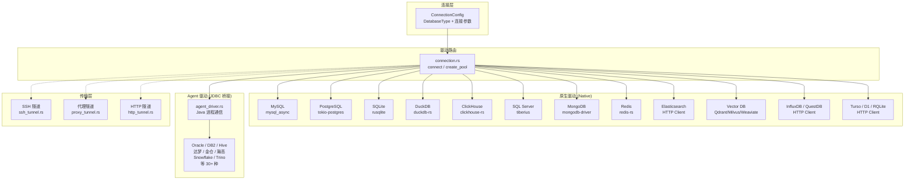

# 内置驱动

DBX 通过**原生 Rust 驱动**和**Agent/JDBC 桥接驱动**两种方式连接数据库，全部内置在约 20 MB 的二进制文件中，无需额外安装运行时。

## 架构概览



## 相关文件索引

### 驱动注册与路由

| 文件 | 说明 |
|------|------|
| `crates/dbx-core/src/models/connection.rs` | `DatabaseType` 枚举（所有支持的数据库类型定义）、`ConnectionConfig` 结构体 |
| `crates/dbx-core/src/connection.rs` | `PoolKind` 枚举（连接池类型）、连接创建与路由逻辑、连接池生命周期管理 |
| `crates/dbx-core/src/db/mod.rs` | 驱动模块声明与公共导出 |

### 原生驱动实现

| 文件 | 数据库 | 关键依赖 |
|------|--------|----------|
| `crates/dbx-core/src/db/mysql.rs` | MySQL / MariaDB / TiDB / OceanBase MySQL | `mysql_async` |
| `crates/dbx-core/src/db/mysql_compatible.rs` | MySQL 兼容数据库通用逻辑 | — |
| `crates/dbx-core/src/db/postgres.rs` | PostgreSQL / Redshift / openGauss / GaussDB / CockroachDB | `tokio-postgres`、`deadpool-postgres` |
| `crates/dbx-core/src/db/sqlite.rs` | SQLite（含 SQLCipher 加密） | `rusqlite` |
| `crates/dbx-core/src/db/duckdb_driver.rs` | DuckDB | `duckdb-rs` |
| `crates/dbx-core/src/db/duckdb_sql.rs` | DuckDB SQL 方言适配 | — |
| `crates/dbx-core/src/db/duckdb_worker_process.rs` | DuckDB 子进程隔离 | — |
| `crates/dbx-core/src/db/duckdb_worker_protocol.rs` | DuckDB Worker 进程间协议 | — |
| `crates/dbx-core/src/db/duckdb_worker_runtime.rs` | DuckDB Worker 运行时管理 | — |
| `crates/dbx-core/src/db/clickhouse_driver.rs` | ClickHouse | HTTP Client |
| `crates/dbx-core/src/db/sqlserver.rs` | SQL Server | `tiberius` |
| `crates/dbx-core/src/db/mongo_driver.rs` | MongoDB | `mongodb` |
| `crates/dbx-core/src/db/redis_driver.rs` | Redis | `redis-rs` |
| `crates/dbx-core/src/db/elasticsearch_driver.rs` | Elasticsearch | HTTP Client |
| `crates/dbx-core/src/db/elasticsearch_sql.rs` | Elasticsearch SQL 翻译 | — |
| `crates/dbx-core/src/db/vector_driver.rs` | Qdrant / Milvus / Weaviate / ChromaDB | HTTP Client |
| `crates/dbx-core/src/db/influxdb_driver.rs` | InfluxDB | HTTP Client |
| `crates/dbx-core/src/db/questdb.rs` | QuestDB | PostgreSQL 协议 |
| `crates/dbx-core/src/db/turso_driver.rs` | Turso | HTTP Client |
| `crates/dbx-core/src/db/rqlite_driver.rs` | RQLite | HTTP Client |
| `crates/dbx-core/src/db/cloudflare_d1/mod.rs` | Cloudflare D1 | HTTP Client |
| `crates/dbx-core/src/db/doris.rs` | Doris / SelectDB | MySQL 协议 |
| `crates/dbx-core/src/db/starrocks.rs` | StarRocks | MySQL 协议 |
| `crates/dbx-core/src/db/manticoresearch.rs` | Manticore Search | MySQL 协议 |
| `crates/dbx-core/src/db/ob_oracle.rs` | OceanBase Oracle 模式 | — |
| `crates/dbx-core/src/db/cloudberry.rs` | Cloudberry | PostgreSQL 协议 |

### Agent 驱动（JDBC 桥接）

| 文件 | 说明 |
|------|------|
| `crates/dbx-core/src/db/agent_driver.rs` | Agent 驱动客户端，通过 IPC 与 Java 进程通信 |
| `crates/dbx-core/src/agent_catalog.rs` | Agent 目录，定义所有 JDBC 驱动映射（30+ 种数据库） |
| `crates/dbx-core/src/agent_manager.rs` | Java Agent 进程生命周期管理 |
| `crates/dbx-core/src/agent_runtime.rs` | Agent 运行时状态监控 |
| `crates/dbx-core/src/agent_connection.rs` | Agent 连接参数构建与错误处理 |
| `crates/dbx-core/src/agent_tools.rs` | Agent 工具函数 |
| `crates/dbx-core/src/jdbc.rs` | JDBC 通用逻辑 |
| `agents/` | Java Agent 工程（Gradle 构建），包含所有 JDBC 驱动依赖 |

### 传输层

| 文件 | 说明 |
|------|------|
| `crates/dbx-core/src/db/ssh_tunnel.rs` | SSH 隧道（russh），支持密码/密钥/Agent 认证 |
| `crates/dbx-core/src/db/ssh_host_key.rs` | SSH 主机密钥校验 |
| `crates/dbx-core/src/db/ssh_prompt.rs` | SSH 交互式提示处理 |
| `crates/dbx-core/src/db/proxy_tunnel.rs` | SOCKS5/HTTP 代理隧道 |
| `crates/dbx-core/src/db/http_tunnel.rs` | HTTP 脚本隧道（PHP 中转） |
| `crates/dbx-core/src/db/transport_layer_tunnel.rs` | 传输层统一抽象 |

### 辅助模块

| 文件 | 说明 |
|------|------|
| `crates/dbx-core/src/db/wkb.rs` | WKB（Well-Known Binary）几何数据解析 |
| `crates/dbx-core/src/db/document_result.rs` | 文档型数据库（MongoDB/ES）结果处理 |
| `crates/dbx-core/src/db/file_validator.rs` | 文件路径校验（SQLite 等文件型数据库） |
| `crates/dbx-core/src/database_capabilities.rs` | 数据库能力检测（特性支持矩阵） |
| `crates/dbx-core/src/external/mod.rs` | 外部数据源（DuckDB 联邦查询） |
| `crates/dbx-core/src/plugins.rs` | 外部驱动插件系统 |

---

## 驱动分类详解

### 一、原生 Rust 驱动（Native）

直接使用 Rust 生态的原生数据库驱动，零额外依赖，性能最优。

#### 1. MySQL 协议族

通过 `PoolKind::Mysql` 连接，底层使用 `mysql_async`。

| DatabaseType | 说明 |
|------|------|
| `Mysql` | MySQL 5.7+ / 8.0+ |
| `Doris` | Apache Doris / SelectDB |
| `StarRocks` | StarRocks |
| `ManticoreSearch` | Manticore Search |

OceanBase MySQL 模式同样走 MySQL 驱动，通过 `driver_profile = "oceanbase"` 区分。

#### 2. PostgreSQL 协议族

通过 `PoolKind::Postgres` 连接，底层使用 `tokio-postgres` + `deadpool-postgres` 连接池。

| DatabaseType | 说明 |
|------|------|
| `Postgres` | PostgreSQL 10+ |
| `Redshift` | Amazon Redshift |
| `OpenGauss` | openGauss |
| `Gaussdb` | GaussDB |
| `CockroachDB` | CockroachDB（通过 PostgreSQL 协议） |
| `Questdb` | QuestDB（通过 PostgreSQL 协议） |
| `Cloudberry` | Cloudberry |

#### 3. SQLite

通过 `PoolKind::Sqlite` 连接，底层使用 `rusqlite`。

| 特性 | 说明 |
|------|------|
| SQLCipher 加密 | 通过 `sqlite-sqlcipher` feature 启用 |

#### 4. DuckDB

通过 `PoolKind::DuckDb` 或 `PoolKind::DuckDbWorker` 连接，底层使用 `duckdb-rs`。

| 模式 | 说明 |
|------|------|
| 进程内（DuckDb） | 直接嵌入，性能最佳 |
| 子进程隔离（DuckDbWorker） | 独立进程运行，崩溃不影响主程序 |

DuckDB 还支持：
- Parquet / CSV / JSON 文件即时预览
- 多文件联邦查询
- DuckDB Worker 并行处理

#### 5. ClickHouse

通过 `PoolKind::ClickHouse` 连接，使用 HTTP 协议与 ClickHouse 通信。

#### 6. SQL Server

通过 `PoolKind::SqlServer` 连接，底层使用 `tiberius`（纯 Rust TDS 协议实现）。

| 配置 | 说明 |
|------|------|
| 传统兼容模式 | `driver_profile = "sqlserver-legacy"` 切换到 JDBC Agent 驱动 |

#### 7. MongoDB

通过 `PoolKind::MongoDb` 连接，底层使用 `mongodb` 官方 Rust 驱动。

支持：
- 标准连接字符串与 Atlas SRV 记录
- 副本集连接
- 传统兼容模式（`driver_profile = "mongodb-legacy"` 切换到 JDBC Agent）

#### 8. Redis

通过 `PoolKind::Redis` 连接，底层使用 `redis-rs`。

支持：
- 所有 Redis 数据类型（String、Hash、List、Set、ZSet、Stream）
- 集群模式
- TLS 加密连接

#### 9. Elasticsearch

通过 `PoolKind::Elasticsearch` 连接，使用 HTTP REST API。

支持：
- SQL 翻译为 Elasticsearch DSL
- 文档浏览

#### 10. 向量数据库

通过 `PoolKind::VectorDb` 统一连接，使用 HTTP API。

| DatabaseType | 说明 |
|------|------|
| `Qdrant` | Qdrant 向量数据库 |
| `Milvus` | Milvus 向量数据库 |
| `Weaviate` | Weaviate 向量数据库 |
| `ChromaDb` | ChromaDB 向量数据库 |

#### 11. HTTP 协议族

通过 HTTP API 连接的轻量数据库：

| DatabaseType | PoolKind | 说明 |
|------|------|------|
| `InfluxDb` | `InfluxDb` | InfluxDB 时序数据库 |
| `Turso` | `Turso` | Turso（基于 libSQL） |
| `CloudflareD1` | `CloudflareD1` | Cloudflare D1 |
| `Rqlite` | `Rqlite` | RQLite 分布式 SQLite |

---

### 二、Agent 驱动（JDBC 桥接）

对于没有成熟 Rust 原生驱动的数据库，DBX 通过 Java Agent 进程桥接 JDBC 驱动。

**工作原理：**
1. DBX 启动一个 Java 子进程（`agents/` 工程构建的 JAR）
2. 通过 IPC（进程间通信）发送 JDBC 操作指令
3. Java 进程使用标准 JDBC 驱动连接数据库，将结果序列化传回

**Agent 驱动目录（`agent_catalog.rs`）：**

| DatabaseType | Agent Key | 数据库 |
|------|------|------|
| `Dameng` | `dameng` | 达梦 DM8 |
| `Kingbase` | `kingbase` | 人大金仓 KingbaseES |
| `Highgo` | `highgo` | 瀚高 HighGo |
| `Uxdb` | `uxdb` | 优炫 UXDB |
| `Vastbase` | `vastbase` | Vastbase |
| `Goldendb` | `goldendb` | GoldenDB |
| `Databend` | `databend` | Databend |
| `Yashandb` | `yashandb` | 崖山 YashanDB |
| `Databricks` | `databricks` | Databricks SQL |
| `SapHana` | `saphana` | SAP HANA |
| `Teradata` | `teradata` | Teradata |
| `Vertica` | `vertica` | Vertica |
| `Firebird` | `firebird` | Firebird |
| `Exasol` | `exasol` | Exasol |
| `OceanbaseOracle` | `oceanbase-oracle` | OceanBase Oracle 模式 |
| `Gbase` | `gbase8a` / `gbase8s` | GBase 8a / 8s |
| `Access` | `access` | Microsoft Access |
| `Oracle` | `oracle` | Oracle |
| `H2` | `h2` | H2 Database |
| `Snowflake` | `snowflake` | Snowflake |
| `Trino` | `trino` | Trino |
| `Hive` | `hive` | Apache Hive |
| `Spark` | `spark` | Apache Spark SQL |
| `Db2` | `db2` | IBM DB2 |
| `Informix` | `informix` | IBM Informix |
| `Neo4j` | `neo4j` | Neo4j 图数据库 |
| `Cassandra` | `cassandra` | Apache Cassandra |
| `Bigquery` | `bigquery` | Google BigQuery |
| `Kylin` | `kylin` | Apache Kylin |
| `Sundb` | `sundb` | SunDB |
| `Oscar` | `oscar` | 神通 OSCAR |
| `Tdengine` | `tdengine` | TDengine |
| `Xugu` | `xugu` | 虚谷 XuguDB |
| `Iotdb` | `iotdb` | Apache IoTDB |
| `Etcd` | `etcd` | etcd |
| `ZooKeeper` | `zookeeper` | Apache ZooKeeper |
| `Iris` | `iris` | InterSystems IRIS |

**消息队列 Agent（`DatabaseType::MessageQueue`）：**

| Driver Profile | Agent Key | 说明 |
|------|------|------|
| `kafka` | `kafka` | Apache Kafka |
| `rocketmq` | `rocketmq` | Apache RocketMQ |
| `rabbitmq` | `rabbitmq` | RabbitMQ |

---

## 驱动使用方式

### 在 DBX 桌面端

1. 打开 DBX → 点击 **"+"** 新建连接
2. 在数据库类型下拉列表中选择目标数据库
3. DBX 自动根据数据库类型选择最优驱动：
   - 有原生驱动的优先使用原生驱动
   - 无原生驱动的自动使用 Agent/JDBC 桥接
4. 部分数据库提供**驱动配置**选项，可手动切换（如 SQL Server 传统模式、MongoDB 传统模式）

### 在 MCP 配置中

MCP 服务器的 `add_connection` 工具通过 `db_type` 参数指定驱动：

```json
{
  "name": "My Oracle DB",
  "db_type": "oracle",
  "host": "192.168.1.100",
  "port": 1521,
  "username": "scott",
  "password": "tiger",
  "database": "ORCL"
}
```

### 驱动运行时管理

DBX 内置驱动运行时监控，可通过 `driver_runtime.rs` 查看：

- 每个 Agent 驱动的进程状态（PID、内存、CPU、运行时长）
- Agent 驱动的启停与重启控制
- 驱动健康状态汇总

### 外部驱动插件

`plugins.rs` 提供外部驱动插件扩展机制，通过 `ExternalDriver` 和 `ExternalTabular` 两种 `PoolKind` 支持第三方驱动集成。

---

## 传输层隧道

所有数据库连接都可叠加以下传输层：

| 隧道类型 | 配置结构体 | 说明 |
|------|------|------|
| SSH 隧道 | `SshTunnelConfig` | 通过 SSH 跳板机连接数据库，支持密码/密钥/SSH Agent 认证 |
| SOCKS5/HTTP 代理 | `ProxyTunnelConfig` | 通过代理服务器连接 |
| HTTP 脚本隧道 | `HttpTunnelConfig` | 通过 PHP 等脚本中转（适用于受限网络环境） |

传输层支持**共享隧道配置**（Settings → Tunnels），一个隧道配置可被多个连接引用。
