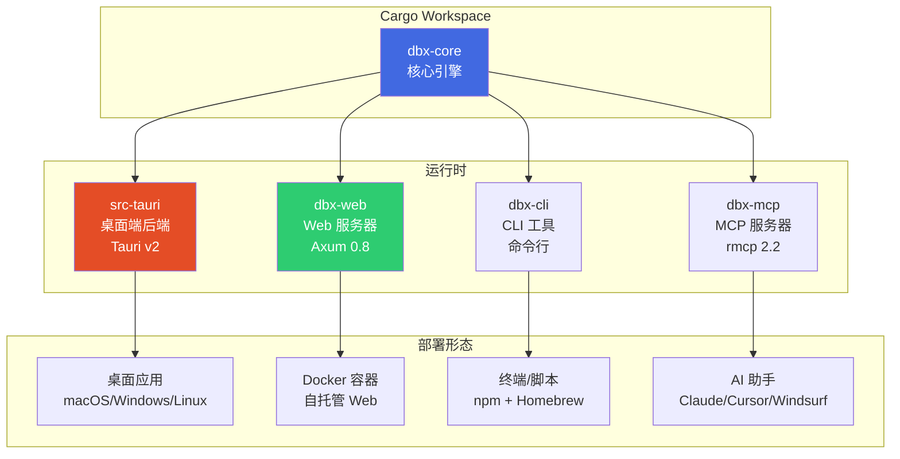

# 后端架构

## 概览

DBX 后端为 Rust 单体仓库（monorepo），所有代码共享同一个 Cargo workspace。根据部署形态分为四种运行时：



## Crate 依赖关系

```
dbx-cli ──→ dbx-core
dbx-mcp ──→ dbx-core
dbx-web ──→ dbx-core (features = ["openapi"])
src-tauri ──→ dbx-core
```

所有 crate 都依赖 `dbx-core`，`dbx-core` 不依赖任何其他 workspace crate。

---

## 一、核心引擎 (dbx-core)

### 1.1 连接池管理 (`connection.rs`)

核心数据结构 `AppState` 管理所有连接池：

```rust
pub struct AppState {
    pub connections: Arc<RwLock<HashMap<String, PoolKind>>>,  // 活跃连接池
    pub configs: RwLock<HashMap<String, ConnectionConfig>>,   // 连接配置
    pub running_queries: RunningQueries,                       // 运行中查询追踪
    pub tunnels: TunnelManager,                                // SSH 隧道
    pub proxy_tunnels: ProxyTunnelManager,                     // 代理隧道
    pub http_tunnels: HttpTunnelManager,                       // HTTP 隧道
    pub storage: Storage,                                      // 持久化存储
    pub plugins: PluginRegistry,                               // 外部驱动插件
    pub agent_manager: AgentManager,                           // Java Agent 管理
    pub transaction_sessions: ...,                             // 事务会话
    // ...
}
```

**`PoolKind` 枚举**定义了 15 种连接池类型，对应不同的数据库驱动。

### 1.2 模块组织

| 模块 | 文件 | 职责 |
|------|------|------|
| **连接** | `connection.rs` | 连接生命周期、池管理、SSH/代理隧道 |
| **查询** | `query.rs`、`query_execution_sql.rs` | SQL 执行引擎、结果流式返回 |
| **查询取消** | `query_cancel.rs` | 运行中查询取消与超时 |
| **Schema** | `schema.rs`、`schema_diff.rs` | Schema 浏览器、结构差异对比 |
| **数据网格** | `data_grid_sql.rs`、`data_grid_extractors/` | 虚拟滚动数据查询、列提取 |
| **AI** | `ai.rs`、`ai_claude_code_cli.rs`、`ai_codex_cli.rs` | AI SQL 生成、解释、优化 |
| **Agent** | `agent_manager.rs`、`agent_runtime.rs`、`agent_connection.rs`、`agent_catalog.rs` | Java Agent 进程管理、JDBC 桥接 |
| **导入导出** | `table_import.rs`、`table_export.rs`、`csv_export.rs`、`xlsx_export.rs`、`text_export.rs` | 多种格式数据导入导出 |
| **数据传输** | `transfer.rs` | 跨数据库数据迁移 |
| **NoSQL** | `mongo_ops.rs`、`redis_ops.rs`、`mongo_shell.rs` | MongoDB/Redis 专用操作 |
| **诊断** | `sql_diagnostics.rs`、`sql_analysis.rs`、`sql_risk.rs` | SQL 诊断、分析、风险检查 |
| **安全** | `production_safety.rs`、`connection_secrets.rs` | 生产环境保护、密码加密 |
| **云同步** | `cloud_sync.rs` | 配置云端同步（WebDAV） |
| **存储** | `storage.rs` | 本地 SQLite 存储（连接、设置、历史） |
| **插件** | `plugins.rs` | 外部驱动插件系统 |
| **类型** | `types.rs` | 通用数据类型定义 |
| **驱动运行时** | `driver_runtime.rs` | Agent 运行时状态监控 |

---

## 二、Tauri 桌面后端 (src-tauri)

### 2.1 架构

```
src-tauri/src/
├── lib.rs                  # Tauri 应用入口、生命周期、托盘、菜单
├── main.rs                 # Rust main 函数
├── commands/               # Tauri IPC 命令（50+ 文件）
│   ├── mod.rs              # 命令注册
│   ├── connection.rs       # 连接管理命令
│   ├── query.rs            # SQL 执行命令
│   ├── ai.rs / ai_multi_config.rs  # AI 命令
│   ├── schema.rs / schema_diff.rs  # Schema 命令
│   ├── mcp.rs / mcp_bridge.rs      # MCP 策略与桥接
│   ├── redis_cmd.rs / mongo_cmd.rs  # NoSQL 命令
│   ├── import/export 相关命令
│   ├── ssh_config.rs / ssh_prompt.rs  # SSH 配置与交互
│   └── ...更多
├── db/                     # 本地数据库初始化
├── models/                 # 数据模型
├── data_dir.rs             # 数据目录管理
└── window_state_guard.rs   # 窗口状态守卫
```

### 2.2 生命周期

1. `main.rs` → 初始化 Tauri Builder → 注册插件和命令
2. `lib.rs` → `run()` → 创建 `AppState` → 注册全局状态 → 启动事件循环
3. 应用启动 → 初始化存储 → 加载连接配置 → 设置托盘/菜单 → 加载前端
4. 关闭 → 检查未保存更改 → 清理连接池 → 关闭 Agent 进程

### 2.3 进程内 MCP 桥接 (`mcp_bridge.rs`)

桌面端内置 MCP 代理，允许外部 AI 工具通过标准输入/输出与 DBX 通信，直接使用桌面端的连接配置。

### 2.4 Tauri 插件

| 插件 | 用途 |
|------|------|
| `tauri-plugin-log` | 日志系统 |
| `tauri-plugin-deep-link` | 深度链接（dbx:// 协议） |
| `tauri-plugin-dialog` | 原生文件对话框 |
| `tauri-plugin-fs` | 文件系统访问 |
| `tauri-plugin-single-instance` | 单实例限制 |
| `tauri-plugin-shell` | Shell 命令执行 |
| `tauri-plugin-updater` | 自动更新 |
| `tauri-plugin-process` | 进程管理 |
| `tauri-plugin-window-state` | 窗口状态持久化 |
| `tauri-plugin-clipboard-manager` | 剪贴板管理 |

---

## 三、Web 后端 (dbx-web)

### 3.1 架构

基于 Axum 0.8 的异步 HTTP 服务器，提供 REST API 和 SSE（Server-Sent Events）实时推送。

```
crates/dbx-web/src/
├── main.rs           # 服务入口，Axum Router 组装
├── state.rs          # WebState（持有 AppState + Web 专用状态）
├── auth.rs           # 密码认证（Argon2 哈希、会话管理、登录限速）
├── error.rs          # 统一错误处理
├── sse.rs            # SSE 实时事件推送
└── routes/           # API 路由（36 个模块）
    ├── mod.rs        # 路由注册
    ├── connection.rs # 连接生命周期
    ├── query.rs      # SQL 执行/取消/会话管理
    ├── ai.rs         # AI 助手
    ├── schema.rs / schema_diff.rs  # Schema 浏览与对比
    ├── mongo.rs / redis.rs         # NoSQL
    ├── transfer.rs                 # 数据传输
    ├── table_import.rs / table_export.rs  # 导入导出
    ├── agents.rs / jdbc.rs         # Agent/JDBC 管理
    ├── mcp_policy.rs               # MCP 安全策略
    ├── cloud_sync.rs               # 云同步
    ├── plugins.rs                  # 插件管理
    ├── mq.rs / etcd.rs / nacos.rs / zookeeper.rs  # MQ/配置中心
    └── ...更多
```

### 3.2 WebState

```rust
pub struct WebState {
    pub app: Arc<AppState>,                       // 核心引擎
    pub data_dir: PathBuf,                        // 数据目录
    pub public_base_path: String,                 // 反向代理基础路径
    pub password_disabled: bool,                  // 是否禁用密码
    pub password_hash: RwLock<Option<String>>,     // Argon2 密码哈希
    pub sessions: RwLock<HashSet<String>>,         // 活跃会话
    pub sse_channels: ...,                         // SSE 推送通道
    pub table_import_channels: ...,                // 表导入进度通道
    pub sql_file_executions: ...,                  // SQL 文件执行取消令牌
    pub login_rate_limit: ...,                     // 登录限速
    pub export_files: ...,                         // 导出文件管理
}
```

### 3.3 认证流程

1. 首次访问 → 检查是否设置密码 → 如未设置则提示创建
2. 登录 → Argon2 验证 → 生成 session cookie
3. 限速 → 5 次失败锁定 60 秒
4. 会话 → cookie 有效期 7 天
5. API 中间件 → 校验 session cookie → 放行/拦截

### 3.4 SSE 实时推送

`/api/sse` 端点提供 Server-Sent Events，支持：
- 查询结果实时推送
- 表导入进度通知
- 连接状态变更
- SQL 文件执行进度

---

## 四、CLI 工具 (dbx-cli)

### 4.1 结构

```
crates/dbx-cli/src/
├── main.rs    # CLI 入口，命令解析与分发
```

精简的单文件 CLI，直接复用 `dbx-core` 的连接和查询能力。

### 4.2 命令

```bash
dbx connections list             # 列出连接
dbx connections list --json      # JSON 格式输出
dbx query <connection> "SQL"     # 执行查询
dbx query <connection> "SQL" --json
```

### 4.3 分发

通过 npm 包 `@dbx-app/cli` 分发，包含平台原生二进制：
- `@dbx-app/cli-darwin-arm64` / `cli-darwin-x64`
- `@dbx-app/cli-linux-arm64-gnu` / `cli-linux-x64-gnu`
- `@dbx-app/cli-win32-arm64` / `cli-win32-x64`

---

## 五、MCP 服务器 (dbx-mcp)

### 5.1 结构

```
crates/dbx-mcp/src/
├── main.rs       # 入口，Stdio 传输启动
├── lib.rs        # 库入口
├── server.rs     # MCP 工具处理器（10 个工具）
├── backend.rs    # DBX 后端抽象（支持本地/远程）
└── paths.rs      # 数据目录路径解析
```

### 5.2 分发

通过 npm 包 `@dbx-app/mcp-server` 分发，同样包含平台原生二进制。Node.js 启动脚本检测平台 → 调用对应原生二进制。

### 5.3 工具列表

| 工具名 | 功能 | 可见性 |
|------|------|------|
| `dbx_list_connections` | 列出连接 | 全局 |
| `dbx_list_tables` | 列出表 | 全局 |
| `dbx_describe_table` | 描述表结构 | 全局 |
| `dbx_execute_query` | 执行 SQL | 全局 |
| `dbx_execute_redis_command` | 执行 Redis 命令 | 全局 |
| `dbx_get_schema_context` | 获取 Schema 上下文 | 全局 |
| `dbx_add_connection` | 添加连接 | 本机/无 scope |
| `dbx_remove_connection` | 移除连接 | 本机/无 scope |
| `dbx_open_table` | 在桌面端打开表 | 仅桌面端 |
| `dbx_execute_and_show` | 执行并展示 | 仅桌面端 |

---

## 六、持久化存储 (`storage.rs`)

所有用户数据存储在本地 SQLite 数据库中（`dbx.db`）：

| 表 | 存储内容 |
|------|------|
| 连接配置 | 加密后的连接信息（密码 AES-256-GCM 加密） |
| 用户设置 | 主题、语言、编辑器偏好 |
| 查询历史 | 完整 SQL 历史记录 |
| 保存的 SQL | 常用 SQL 片段与文件夹 |
| MCP 策略 | 连接白名单与权限配置 |
| 隧道配置 | SSH/代理隧道共享配置 |
| 插件注册 | 已安装的外部驱动插件信息 |

配置支持通过 WebDAV 进行云端同步（`cloud_sync.rs`）。
