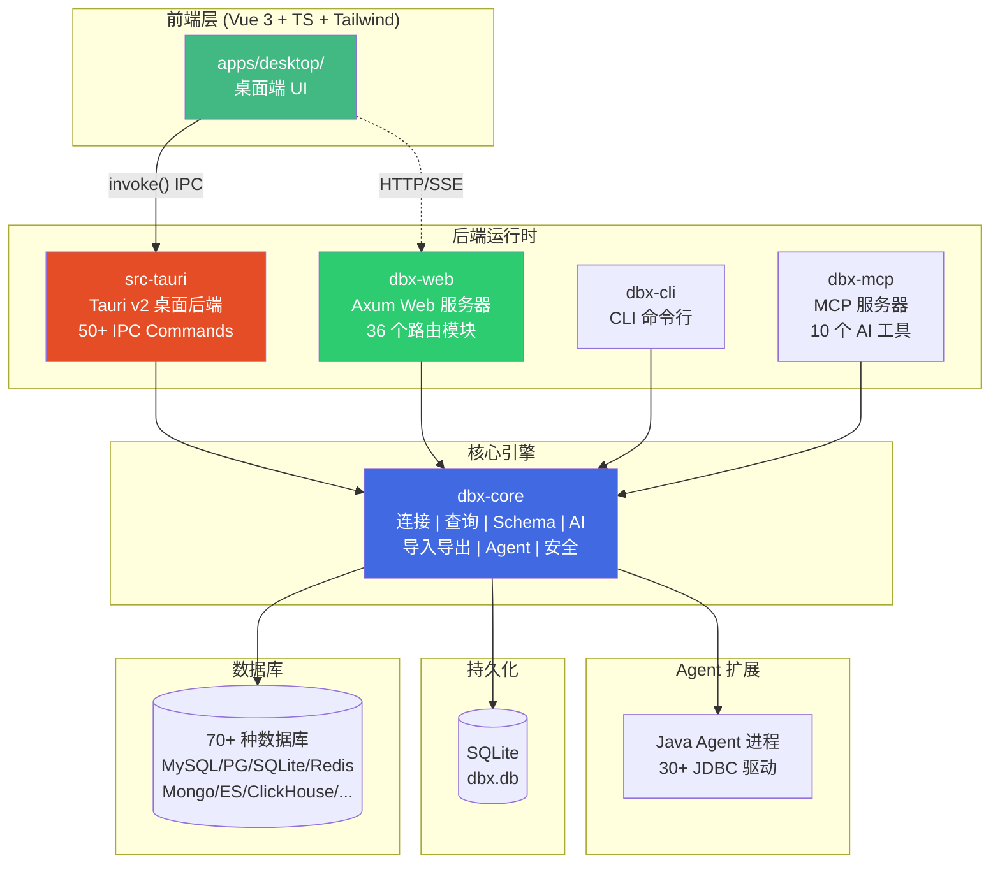

# DBX 项目概述

## 简介

**DBX** 是一个开源的轻量级数据库管理工具，使用 Rust 构建，单个约 20 MB 的二进制文件即可支持 **70+ 种数据库**。无需 Java 运行时、Python 虚拟环境或内嵌 Chromium，跨平台运行于 macOS、Windows 和 Linux。

DBX 提供桌面端原生应用、Docker 自托管 Web 版、CLI 命令行工具，以及内置 AI 助手和 MCP Server，让 AI 编程助手能够直接查询数据库。

## 技术栈

| 层级 | 技术 |
|------|------|
| **语言** | Rust (edition 2021, MSRV 1.88) |
| **桌面框架** | Tauri v2 (WebView2/WKWebView/WebKitGTK) |
| **Web 框架** | Axum 0.8 (Rust HTTP 框架) |
| **异步运行时** | Tokio |
| **前端** | Vue 3 + TypeScript + Vite + Tailwind CSS v4 |
| **序列化** | Serde + serde_json |
| **数据库驱动** | 原生 Rust 驱动 + JDBC Agent 扩展 |
| **MCP 协议** | rmcp 2.2 |
| **包管理** | pnpm (前端) / Cargo (Rust) |
| **容器化** | Docker (多架构 amd64/arm64) |

## 全栈架构

### Crate / 项目说明

| Crate / 目录 | 类型 | 版本 | 说明 |
|------|------|------|------|
| `apps/desktop/` | Vue 3 前端 | — | Tauri 桌面端前端，Vue 3 + TypeScript + Vite + Tailwind CSS |
| `dbx-core` | Rust lib | 0.1.0 | 核心引擎，所有数据库连接、查询、Schema、AI、导入导出逻辑 |
| `src-tauri` | Rust bin+lib | 0.5.67 | Tauri v2 桌面应用后端，50+ IPC 命令，library 名 `dbx_lib` |
| `dbx-web` | Rust bin | 0.5.67 | Axum Web 后端，REST API + SSE 实时推送，36 个路由模块 |
| `dbx-cli` | Rust bin | 0.4.43 | CLI 命令行工具，npm 包 `@dbx-app/cli`，二进制名 `dbx` |
| `dbx-mcp` | Rust bin | 0.4.43 | MCP 服务器，npm 包 `@dbx-app/mcp-server`，二进制名 `dbx-mcp` |
| `agents/` | Java (Gradle) | — | Java Agent 工程，JDBC 驱动依赖与 IPC 服务 |
| `packages/` | npm 包 | — | CLI/MCP 各平台原生二进制 npm 分发包 |

### dbx-core 核心模块

| 模块 | 说明 |
|------|------|
| `connection` | 数据库连接管理（创建、编辑、删除连接） |
| `query` / `query_execution_sql` | SQL 查询执行引擎 |
| `schema` / `schema_diff` | Schema 浏览器、结构对比 |
| `data_grid_sql` | 数据网格虚拟滚动与编辑 |
| `ai` / `ai_claude_code_cli` / `ai_codex_cli` | AI SQL 助手（支持 Claude、OpenAI、本地模型） |
| `agent_manager` / `agent_runtime` / `agent_tools` | Agent/JDBC 驱动管理 |
| `mongo_ops` / `redis_ops` | MongoDB / Redis 专用操作 |
| `mq/` | 消息队列管理（Pulsar、Kafka、RocketMQ） |
| `transfer` | 跨数据库数据传输 |
| `table_import` / `table_export` | 表数据导入导出 |
| `csv_export` / `xlsx_export` / `text_export` | 多格式数据导出 |
| `sql_diagnostics` / `sql_analysis` / `sql_risk` | SQL 诊断、分析与风险检查 |
| `cloud_sync` | 云端配置同步 |
| `ssh_config` | SSH 隧道配置 |
| `production_safety` | 生产环境保护机制 |

## 支持的数据库

### 原生直连驱动
MySQL, PostgreSQL, SQLite, DuckDB, Redis, MongoDB, ClickHouse, SQL Server, Oracle, Elasticsearch, MariaDB, TiDB, OceanBase, openGauss, GaussDB, KWDB, KingBase, Vastbase, GoldenDB, Doris, SelectDB, StarRocks, Manticore Search, Redshift, DM, TDengine, 虚谷 XuguDB, CockroachDB, Access, HighGo, UXDB, Cloudflare D1, Qdrant, Milvus, Weaviate 等

### Agent/JDBC 扩展
H2, Snowflake, Trino, PrestoSQL, Hive, DB2, Informix, Neo4j, Cassandra, BigQuery, Kylin, SunDB, Databricks, SAP HANA, Teradata, Vertica, Firebird, Exasol, 崖山 YashanDB, GBase 8a/8s, Databend, RQLite, Turso, InfluxDB, QuestDB, IoTDB, etcd, ZooKeeper, Nacos, IRIS 及自定义 JDBC

### 消息队列
Pulsar, Kafka, RocketMQ

## 发布渠道

| 渠道 | 说明 |
|------|------|
| [GitHub Releases](https://github.com/t8y2/dbx/releases) | 直接下载安装包 |
| Homebrew (`brew install --cask dbx`) | macOS |
| Scoop (`scoop install dbx`) | Windows |
| WinGet (`winget install t8y2.dbx`) | Windows |
| Flatpak | Linux |
| Docker (`t8y2/dbx:latest`) | 自托管 Web 版 |
| npm (`npx @dbx-app/mcp-server`) | MCP 服务器 |
| npm (`npm install -g @dbx-app/cli`) | CLI 工具 |

## 社区

- GitHub: https://github.com/t8y2/dbx
- QQ 群: 1087880322
- Discord: https://discord.gg/W7NyVDRt6a
- 官网: https://dbxio.com

## 文档索引

| 文档 | 说明 |
|------|------|
| [项目概述](./项目概述.md) | 项目简介、全栈架构、技术栈、Crate 说明 |
| [前端架构](./前端架构.md) | Vue 3 前端技术栈、组件目录、数据网格、SQL 编辑器、AI 面板、i18n |
| [后端架构](./后端架构.md) | 四种运行时（Tauri/Web/CLI/MCP）、核心引擎、持久化存储 |
| [内置驱动](./内置驱动.md) | 原生驱动 11 大类、Agent/JDBC 33+ 种、驱动文件索引 |
| [API 参考](./API参考.md) | MCP 工具参考、Web REST API 路由、Tauri IPC 命令 |
| [快速开始](./快速开始.md) | 安装、Docker、MCP 配置、本地开发 |
| [使用示例](./使用示例.md) | 桌面端/Docker/CLI/MCP 操作示例 |
| [常见问题](./常见问题.md) | 20+ 条 FAQ（安装/连接/MCP/AI/性能/安全） |
